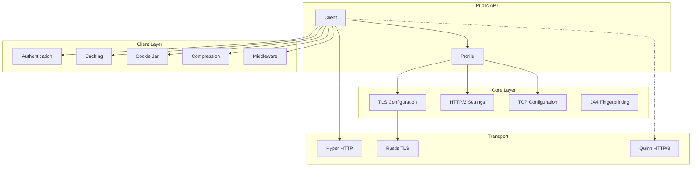
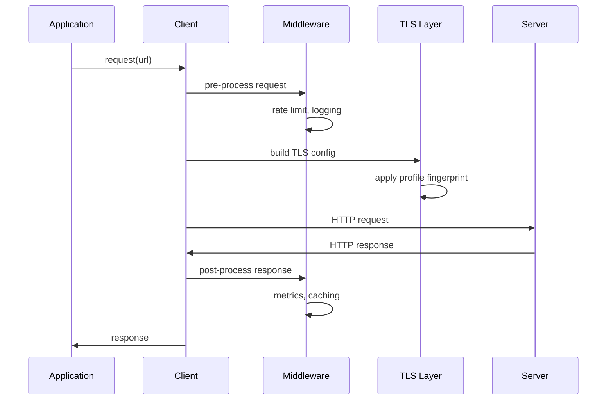

# Architecture

This document describes the internal architecture of the Spectreq HTTP client library.

## Overview

Spectreq is a Rust HTTP client designed for browser impersonation and anti-bot detection bypass. It provides accurate TLS, HTTP/2, and TCP fingerprinting to mimic real browsers.



## Module Structure

```
spectreq/
├── src/
│   ├── lib.rs              # Public API re-exports
│   ├── core/               # Core fingerprinting
│   │   ├── mod.rs
│   │   ├── profile.rs      # Browser profiles
│   │   ├── tls.rs          # TLS configuration
│   │   ├── tcp.rs          # TCP settings
│   │   ├── ja4.rs          # JA4 fingerprinting
│   │   ├── headers.rs      # Header ordering
│   │   ├── ech.rs          # Encrypted Client Hello
│   │   └── error.rs        # Error types
│   │
│   └── client/             # HTTP client implementation
│       ├── mod.rs
│       ├── client.rs       # Main client
│       ├── auth.rs         # Authentication
│       ├── cache.rs        # Response caching
│       ├── cookies.rs      # Cookie management
│       ├── compression.rs  # Decompression
│       ├── metrics.rs      # Request timing
│       ├── middleware.rs   # Middleware chain
│       ├── proxy.rs        # Proxy support
│       └── session.rs      # Session persistence
│
└── spectreq-py/            # Python bindings
    └── src/
        ├── lib.rs          # PyO3 module
        ├── profile.rs      # Profile bindings
        └── client.rs       # Client bindings
```

## Core Components

### Profile System

Profiles encapsulate all browser-specific configuration:

| Component | Description |
|-----------|-------------|
| TLS Config | Cipher suites, extensions, ALPN, GREASE |
| HTTP/2 Settings | Window size, concurrent streams, header table |
| TCP Config | TTL, window size, keepalive |
| Headers | Ordered headers for JA4H fingerprinting |
| Client Hints | Sec-CH-UA-* headers |

### TLS Fingerprinting

The TLS layer ensures the ClientHello matches real browsers:

1. **Cipher Suite Order**: Matches browser preference
2. **Extensions**: Correct order and values
3. **GREASE**: Chrome uses GREASE, Firefox doesn't
4. **ALPN**: h2, http/1.1 negotiation
5. **Post-Quantum**: X25519Kyber768 for Chrome 131+

### JA4 Fingerprint Generation

JA4 fingerprints are generated from:
- Protocol version (t = TLS)
- SNI present flag (d/i)
- Cipher count
- Extension count  
- ALPN first value
- Cipher hash (truncated)
- Extension hash (truncated)

## Request Flow



## Python Bindings

The Python bindings use PyO3 to expose a Python-native async API:

```python
from spectreq import Client, Profile

async def example():
    profile = Profile.chrome_143_windows()
    client = Client(profile=profile)
    response = await client.get("https://example.com")
    print(response.json())
```

The bindings translate between Python and Rust types, using `pyo3-async-runtimes` for async conversion.

## Feature Flags

| Feature | Description | Dependencies |
|---------|-------------|--------------|
| `post-quantum` | X25519Kyber768 key exchange | rustls-post-quantum |
| `ech` | Encrypted Client Hello | reqwest (for ECH config fetch) |
| `http3` | HTTP/3 support | quinn, h3, h3-quinn |

## Performance Considerations

1. **Connection Pooling**: HTTP/2 connections are reused
2. **Compression**: Automatic Brotli/Gzip/Zstd decompression
3. **Caching**: In-memory cache with Cache-Control support
4. **Zero-Copy**: Streaming responses where possible

## Security Considerations

See [SECURITY.md](./SECURITY.md) for security policies and practices.
